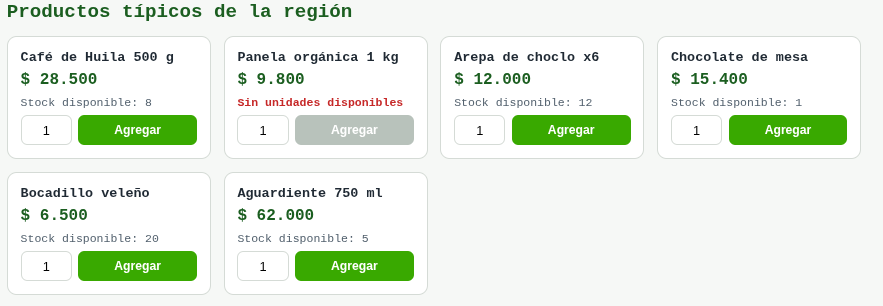
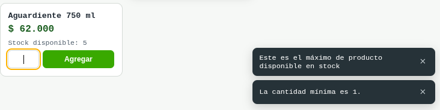
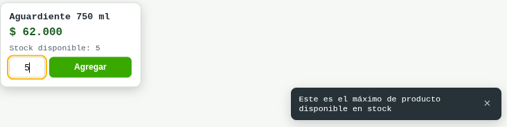
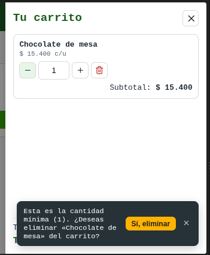
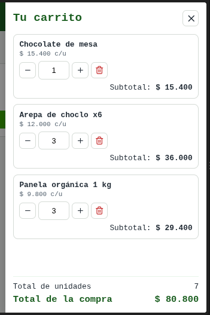
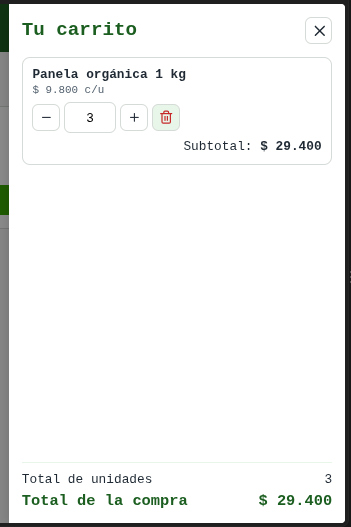
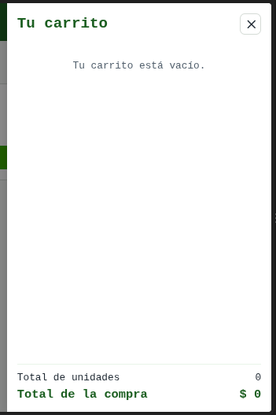

# 🛒 TIENDA PALMIRA – Carrito de Compras con Validaciones de Stock

Reto práctico React – SENA, Centro de Biotecnología Industrial (CBI) Palmira – Desarrollo Front-End con React.
Instructor: Daniel Alfonso Martínez Payán.

## 1. Aprendices y ficha

| Campo | Valor |
|-------|-------|
| Aprendices | Isabella Montoya, Jean Cardona (ADSO) |
| Ficha | [3400626] |

> El reto indica modalidad individual; los datos de ficha y documento quedan por completar.

## 2. Enlace del repositorio público

- Repositorio: [https://github.com/Ryuuk123/Equipo_2_Carrito_React]
- Nombre sugerido: `Equipo_2_Carrito_React`

## 3. Tecnología usada

- ☑ React (Vite, JavaScript/JSX)
- ☑ HTML + CSS + JS puros
- CSS puro (sin frameworks), `lucide-react` para íconos
- Toasts: componente propio (sin librerías ni `alert()`)
- Pruebas: Vitest + React Testing Library
- Persistencia del carrito en `localStorage`

## 4. Instalación y ejecución

```bash
git clone <https://github.com/Ryuuk123/Equipo_2_Carrito_React.git>
cd Apellido_Nombre_CarritoReact
npm install
npm run dev      # abre http://localhost:5173
npm test         # ejecuta las pruebas automatizadas (12 casos del instructor)
npm run build    # genera la versión de producción en /dist
```

## 5. Capturas de pantalla

**Navbar e ícono con contador**


**Agregar producto desde el catálogo**


**Bloqueo de la tecla "e", negativos y 0**


**Toast de stock máximo**


**Toast de cantidad mínima con opción de eliminar**


**Subtotales y total con varios productos**


**Producto eliminado y total recalculado**



## 6. Tabla de evidencias

| # | Funcionalidad | Captura (nombre o ruta) | ¿Funciona? (Sí/No) |
|---|---------------|-------------------------|--------------------|
| 1 | Navbar e ícono con contador | | |
| 2 | Agregar producto desde el catálogo | | |
| 3 | Bloqueo de la tecla "e" y de negativos / 0 | | |
| 4 | Toast de stock máximo | | |
| 5 | Toast de cantidad mínima con opción de eliminar | | |
| 6 | Subtotales y total con varios productos | | |
| 7 | Producto eliminado y total recalculado | | |

La checklist manual de los 12 casos de prueba está en [`docs/CHECKLIST_PRUEBAS.md`](docs/CHECKLIST_PRUEBAS.md).

## 7. Enlace de despliegue (opcional)

- URL: [COMPLETAR]

Opciones para publicar en línea:
- **Vercel / Netlify:** importar el repositorio, comando de build `npm run build`, carpeta de salida `dist`.
- **GitHub Pages:** agregar `base: "/NOMBRE_DEL_REPO/"` en `vite.config.js`, ejecutar `npm run build` y publicar la carpeta `dist`.

## 8. Checklist de verificación y entrega

| ✓ | Criterio de verificación | ¿Cumple? |
|---|--------------------------|----------|
| ☑ | La aplicación corre con los comandos `npm install` y `npm run dev`. | |
| ☑ | El repositorio es público y se puede clonar sin pedir credenciales. | |
| ☑ | El catálogo sale de un array JSON con id, nombre, precio y stock. | |
| ☑ | El ícono del carrito está en la navbar, a la derecha, con contador de unidades. | |
| ☑ | Ningún campo de cantidad acepta letras (especialmente la e), signos, puntos, comas, 0 ni negativos. | |
| ☑ | Nunca se supera el stock y siempre aparece el toast de máximo disponible. | |
| ☑ | Con cantidad 1, al restar (o escribir 0) aparece el toast del mínimo con opción de eliminar. | |
| ☑ | Los subtotales y el total cuadran al agregar más del mismo producto, cambiar cantidades o eliminar. | |
| ☑ | El README incluye el enlace del repositorio, las instrucciones y las capturas de evidencia. | |
